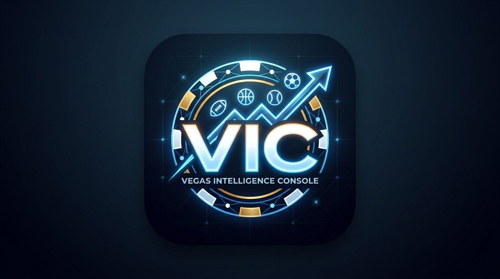

<div align="center">



# VIC — Vegas Intelligence Console

**Sharp betting intelligence terminal. Runs locally from USB, self-hosted, or deployed to the cloud.**

[](./LICENSE)
[](./package.json)
[](https://railway.app)

**Open Source · MIT License · Free Forever**

[Features](#features) · [Screenshots](#screenshots) · [Quick Start](#quick-start) · [Deploy](#deploy) · [API Setup](#api-setup) · [Contributing](#contributing) · [Support](#support)

</div>

---

## What is VIC?

VIC is a **self-contained betting intelligence platform** built for sharp bettors who want full control over their data, their models, and their edge.

- **No subscriptions** — pay only for the APIs you use (or use the free tiers)
- **No data mining** — everything stays on your machine or your server
- **No lock-in** — MIT licensed, fork it, modify it, sell it if you want
- **Works offline** — runs from a USB stick without internet (after initial setup)

VIC pulls live odds, scores, injuries, public betting percentages, and weather — then layers AI analysis on top to surface edges the public misses.

---

## Features

| Module | What it does |
|--------|-------------|
| **🏠 Dashboard** | Live games, news feed, Ask VIC chatbot, recent bets, status monitor |
| **🦾 Legs** | AI edge model — scans live odds + injuries + public % + weather to generate graded picks |
| **📊 Odds** | Live odds from Hard Rock Bet, FanDuel, DraftKings, BetMGM via The Odds API |
| **📱 Scores** | Live scores & schedule from ESPN |
| **🏆 Props** | Player props with multi-book price comparison |
| **👥 Public %** | SAO consensus — ticket %, money %, fade / steam / reverse line movement signals |
| **🚨 Alerts** | Line movement monitor — auto-scans every 5 min, alerts on significant moves |
| **📰 Intel Feed** | ESPN news, scores, standings, leaders, AI-generated daily digest |
| **🏥 Injuries** | ESPN per-team injury report with AI impact analysis |
| **🧠 AI Analysis** | Claude Sonnet + web search — deep game/slate analysis, trends, situational edges |
| **🌤️ Weather** | Open-Meteo stadium weather for NFL/MLB outdoor venues |
| **📊 Stats** | ESPN league leaders + division standings |
| **📋 Bet Tracker** | Log bets, set results, auto-P/L tracking, CSV export |
| **📈 CLV** | Closing line value tracker — snapshots odds, measures sharpness over time |
| **💰 Bankroll** | P/L chart, monthly breakdown, win rate, ROI, AI performance review |
| **🔗 Parlay** | AI parlay finder + manual builder with correlation check |
| **🔧 Tools** | EV calculator, Kelly criterion, odds converter, hedge calculator, arb finder, sharp money tracker, prop trends, AI scout |
| **📝 Logs** | Full system event log with filters, export, and toggle |
| **⚙️ Settings** | API keys, preferences, system diagnostics, data management |

### Security

- **Client-side PIN lock** — 4-digit PIN protects the UI (localStorage-based)
- **API keys never exposed** — backend proxies all API calls; keys are masked in config responses
- **Zero telemetry** — no analytics, no tracking, no phoning home

---

## Quick Start

### 📦 Option A: Run Locally (USB or any folder)

**Requirements:** [Node.js 18+](https://nodejs.org)

```bash
# 1. Clone or download
git clone https://github.com/oddsifylabs/vic.git
cd vic

# 2. Install dependencies
npm install

# 3. Start
node proxy.js

# 4. Open browser
open http://localhost:3747
```

**Windows users:** Double-click `start.bat` or right-click `start.ps1` → Run with PowerShell.

**Linux/Mac users:** Run `bash start.sh`.

> 💡 **USB tip:** If your USB drive is FAT32/exFAT, the start scripts automatically install dependencies to your home drive (`~/.vic_modules/`) and point Node there via `NODE_PATH`. Your data stays on the USB.

### ☁️ Option B: Deploy to Railway (Free Tier)

1. Fork this repo to your GitHub account
2. Go to [railway.app](https://railway.app) → **New Project** → **Deploy from GitHub repo**
3. Select your `vic` fork
4. Railway auto-detects the `Procfile` and deploys
5. Go to **Settings → Networking** and ensure the port is set to `$PORT`
6. Done — VIC is live at your Railway URL

> ⚠️ **Railway free tier note:** The `data/` folder is ephemeral (resets on redeploy). Your bets, config, and logs persist while the container is running. For permanent storage, attach a Railway Volume or run locally.

### 📦 Option C: Docker (if you prefer containers)

```bash
docker build -t vic .
docker run -p 3747:3747 -v $(pwd)/data:/app/data vic
```

*(Dockerfile not included yet — [PRs welcome](#contributing))*

---

## API Setup

VIC needs **two optional API keys** to unlock full power. Everything else is free.

| Service | Key | Cost | What it powers |
|---------|-----|------|---------------|
| **The Odds API** | [Get key →](https://the-odds-api.com) | 500 free req/month | Live odds, props, scores |
| **Claude API** | [Get key →](https://console.anthropic.com) | Pay-as-you-go | AI Analysis, Legs model, Ask VIC |
| ESPN | Free | $0 | Scores, injuries, news, stats |
| SAO Scraper | Free | $0 | Public betting %, consensus |
| Open-Meteo | Free | $0 | Weather |

### How to add keys

1. Start VIC and go to **Settings** (⚙️)
2. Paste your keys in the **API KEYS** tab
3. Click **SAVE ALL**
4. Run **SYSTEM TESTS** to verify

Your keys are stored in `data/config.json` — never committed to Git (it's in `.gitignore`).

---

## Project Structure

```
vic/
├── proxy.js              # Express server — API proxy, scrapers, storage
├── vic.js                # Shared frontend utilities
├── vic.css               # Global styles (terminal green theme)
├── *.html                # Page modules (index, odds, tracker, etc.)
├── data/                 # Local storage (gitignored)
│   └── config.json       # API keys + preferences
│   └── bets.json         # Bet history
│   └── clv.json          # Closing line value records
│   └── logs.json         # System event log
│   └── ...
├── start.sh / .bat / .ps1  # Launchers
├── package.json
├── LICENSE
└── README.md
```

---

## Tech Stack

- **Backend:** Node.js + Express + native `fetch`
- **Frontend:** Plain HTML5 + CSS3 + vanilla JavaScript (zero frameworks, zero build step)
- **Scraping:** Cheerio + native `fetch` with custom headers
- **Data:** JSON files on disk (`data/`)
- **AI:** Anthropic Claude API (Sonnet 4.6 / Haiku 4.5 with prompt caching)

---

## Screenshots

*(Screenshots coming soon — [contribute yours!](#contributing))*

| Dashboard | Legs Model | Odds Screen |
|-----------|-----------|-------------|
| *(placeholder)* | *(placeholder)* | *(placeholder)* |

---

## Contributing

We welcome bug reports, feature ideas, and pull requests.

See [**CONTRIBUTING.md**](./CONTRIBUTING.md) for guidelines.

Quick ways to help:
- 🐛 Report bugs via [GitHub Issues](https://github.com/oddsifylabs/vic/issues)
- 💡 Suggest features via [GitHub Discussions](https://github.com/oddsifylabs/vic/discussions)
- 📝 Improve docs (this README, inline comments, guides)
- 🎨 Share screenshots of your setup for the gallery
- 🔧 Add a Dockerfile, GitHub Action, or new data source

---

## Support & Donations

VIC is **free and open source**. Development is funded by the community.

If VIC helps you find an edge, consider supporting the project:

| Platform | Link | Best For |
|----------|------|----------|
| **GitHub Sponsors** | [github.com/sponsors/oddsifylabs](https://github.com/sponsors/oddsifylabs) | Developers, recurring support, zero fees |
| **Ko-fi** | [ko-fi.com/oddsifylabs](https://ko-fi.com/oddsifylabs) | One-time tips, casual supporters |
| **Crypto** | `BTC: ...` / `ETH: ...` | Privacy-focused, international |

> 🙏 Every dollar goes directly into development — new data sources, faster scrapers, sharper models, and keeping VIC free forever.

### For Businesses / Syndicates

If you run a betting syndicate, tout service, or sports media company and want a **white-label VIC**, custom integrations, or priority feature development, email: **partners@oddsifylabs.com**

---

## Roadmap

- [ ] Docker image + Compose file
- [ ] SQLite backend option (for larger bet databases)
- [ ] WebSocket live odds streaming
- [ ] Mobile app wrapper (Capacitor)
- [ ] Social features (share picks, leaderboards)
- [ ] Additional sports: Soccer (EPL/UCL), MMA (UFC), Golf, Tennis Grand Slams
- [ ] Machine learning model for automated edge detection
- [ ] Bet placement API integrations (where legal)

---

## Data & Privacy

- **All personal data** (bets, keys, logs) is stored in `data/` on your machine
- **API keys** are stored in `data/config.json` — never sent anywhere except the official API endpoints
- **No tracking**, no analytics, no cookies, no third-party scripts (except Google Fonts)
- **`data/` is in `.gitignore`** — it will never be committed to GitHub

---

## License

[MIT License](./LICENSE) — Copyright (c) 2025 Oddsify Labs

Free for personal and commercial use. Modify, fork, redistribute. No restrictions.

---

<div align="center">

Built with ♥️ by [Oddsify Labs](https://www.oddsifylabs.com)

**💾 [github.com/oddsifylabs/vic](https://github.com/oddsifylabs/vic)**

</div>
